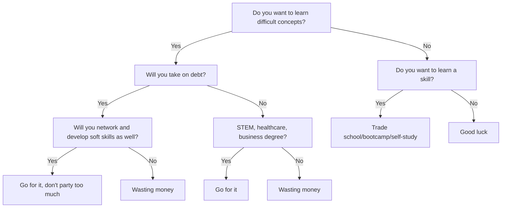

+++
title = 'Money'
date = 2024-09-11T12:36:46-04:00
draft = false
summary = 'My experience in dealing with money'
+++

This is a testimony of my mostly self-directed personal finance journey. It will be very disorganized and rambling, but I hope my points are made.

# Step 0

Unfortunately, dealing with money requires dealing with human nature

I suppose I was raised to appreciate delayed gratification. That's something I literally remember as a child

we used to get money for doing chores, a nickel for doing the dishes, a dime for doing the laundry, five bucks for mowing the lawn, etc.
I have positive memories associated with using the riding mower, and i could imagine that the reward associated with doing the task would have contributed to my nostalgic sentiment for them.
I attributed my driving ability to using a riding mower early on.

## Get started early

There are multiple ways to get started. Are you a real self-starter? Learn an economically relevant skill. If you start programming in middle school or high school and you get it and enjoy it, you will have a head start on so many people. 

My classmate had a brother who wrote a program to create bootable USBs on MacOS. He says this made over $10,000 before he even left high school. He is now employed at Apple. 

It seems that the businesses with the least amount of overhead are web-based startups. My reasoning is that nowadays, all you need is a computer really. I would imagien that a savvy engineer could develop and ship a profitable product using just a MacBook Pro.

As a career engineer, I certainly may be biased to tech-related fields, but it doesn't need to be super geeky stuff; good photo/videographers make good money if they stay booked, basically any trade (plumbing, electricianship, welding, general contracting, etc.) will make good money.

Having real business experience early will pay massive dividends, especially for the paperwork to form the company, dealing with the local and state gov't, etc.

My classmate was like me and lived as normal lives as one could imagine, get good grades, do sports, do extracurriculars, play video games, talk to girls. While I did learn valuable soft skills from these --  and honestly some hard skills from video games since I built my own computer, got interested in computing hardware etc. -- I wish I spent more time working on things that make money. 

Of course, we chose the other way of making moeny, wage slaving. 

Don't worry, I'm being overly drastic. While working those jobs is not the most fun, enjoyable, or enriching experience in the world, *iT bUIlDs cHAraActEr!!!*

I worked at Subway for a year and a half, went to prep cooking, then became a Chinese food delivery driver and host.

Subway definitely was not the greatest time. I often closed on weekdays at 10pm and opened on weekends at 7:30 am, we often would get swamped, and my coworker pulled the bread knives on me once. I later saw him working the drive thru at the KFC years later.

Prep cooking at the Skinny Pancake was interesting, since I essentially got poached while working. The head chef of the Skinny Pancake was getting a sandwich and noticed that I was alone, serving a line of at least 15 people. He asked how much they're paying me, scoffed, and told me to apply downstairs. I obliged.

I lasted maybe 6 months, I started doing actual prep work, but I was not at the comptency demanded. I got moved to dishwashing, and got stuck there. I could handle it, but it was hot and loud and the other guys ripped darts which I wasn't about.

Chinese delivery was amazing. Since families will often get $30-$60 orders to feed everyone, you get pretty good tips. During peak holiday season, you could get over $100/hr in tips, often cash. I did this my junior and senior years, and continued during the holidays my first two years of college.

- Learn a skill
    - programming / web
    - photography / videography
    - car mechanic
- High school job
    - food service
    - retail

## Investment

Get in as early as possible

Accounts:
1. Local savings bank
2. High yield savings account (HYSA)
3. Roth IRA
4. Brokerage

## Making Money

Not so good at this one

### To College or Not To College

This is a vastly over-generalized decision tree

Ultimately, any opportunity in life is what you amke of it, and some people are able extract more value out of an ooportunity than others.