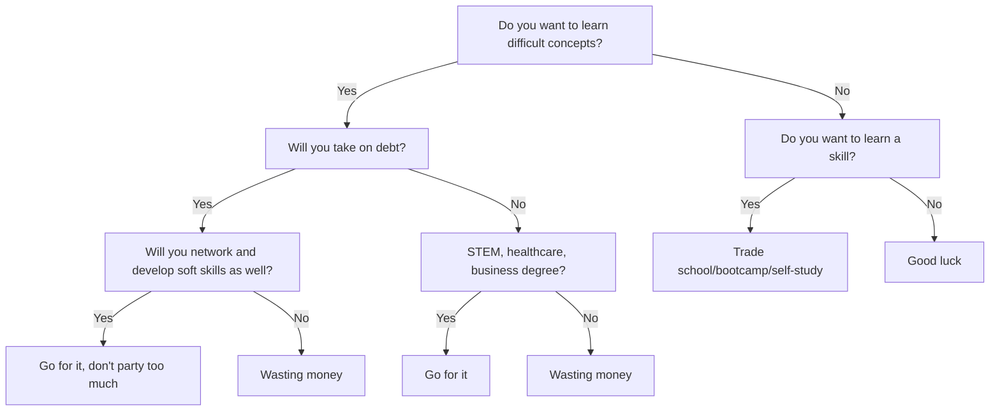

+++
title = 'Money'
date = 2024-09-11T12:36:46-04:00
draft = false
summary = 'My experience in dealing with money'
+++

This is a testimony of my mostly self-directed personal finance journey. It will be very disorganized and rambling, but I hope my points are made.

Unfortunately, dealing with money requires dealing with human nature.
The sooner you accept yourself and the better you understand yourself, the easier these habits become.

I was raised to appreciate delayed gratification.
One of my core memories is of my dad stressing the importance of this concept, and it is something I have applied to (most of) my life.
If you do not already appreciate and practice delayed gratification, start here.
Establish simple habits that improve the quality of your life.
Once you learn how to do this, the rest becomes easy.

## Get started early

Growing up, my brother and I would get an allownace for doing chores - a nickel for doing the dishes, a dime for doing the laundry, five bucks for mowing the lawn, etc.
I legitimately had fun from using the riding mower, which likely reinforced my understanding of delayed gratification and positive impression of work.
I also attribute my driving ability to using a riding mower early on.

While my experience is not universal, there are multiple ways to get started.

### Get good

Are you a real self-starter?
Learn an economically relevant skill and get good at it.

Are you super into cars?

If there's simple routine maintenance to do on the family car, be sure to involve yourself.
Watch YouTube videos and read articles about the industry, whether you're into body design, engine design, repairs, restomods, anything!
By the time you reach high school, you likely will have enough knowledge and experience to volunteer at an independent shop, which is a huge resume add.
Whether you decide to continue working the trade out of high school, or use the experience to apply for an engineering program, you have gained credibility and reputation from those you have worked with.

Are you super into computers?

If you start programming in middle school or high school and you get it and enjoy it, you will have a significant head start. My classmate had a brother who wrote a program to flash Linux on Macbooks. He says this made over $10,000 before he even left high school. He is now employed at Apple.

Opportunities can appear from play as well.
Say you're a really good Minecraft builder.
If you're confident enough, you could share your gameplay and build a community.

If they like you like that, you now have a captive audience to offer a product to.
You might see in your comments section that people are having difficulty hosting their own Minecraft server.
Maybe you've deployed your own server in the past, and while tedious, it wasn't the hardest thing in the world.
Maybe you could launch a platform for your community to host their servers on.

As an engineering graduate, I certainly may be biased to tech-related fields, but it doesn't need to be super geeky stuff; good photo/videographers make good money if they stay booked; basically any trade (plumbing, electricianship, welding, general contracting, etc.) will make good money if you do it well.

Whatever you choose to do, having real business experience early on will pay massive dividends, especially in filing the paperwork to form the company, interfacing with the local and state gov't, dealing with customers, etc.

### Normal jobs

Unlike his brother, my classmate was like me and lived as normal lives as one could imagine - get good grades, do sports, do extracurriculars, play video games, talk to girls - the standard playbook.
While I did learn valuable soft skills from these - and honestly some hard skills from video games since I built my own computer, got interested in computing hardware etc. - I wish I spent more time working on things that make money.

Of course, we chose the other way of making money, wage slaving for the mega corps.

Don't worry, I'm being overly drastic.
While working those jobs is not the most fun, enjoyable, or enriching experience in the world, *iT bUIlDs cHAraActEr!!!*

I worked at Subway for a year and a half, went to prep cooking, then became a Chinese food delivery driver and host.

Subway definitely was not the greatest time.
I often closed on weekdays at 10pm and opened on weekends at 7:30 am, we often would get swamped, and my coworker pulled the bread knives on me once.
I later saw him working the drive thru at our KFC a couple years later.

Prep cooking at the Skinny Pancake was interesting, since I essentially got poached while working at Subway.
The head chef of the Skinny Pancake was getting a sandwich and noticed that I was alone, serving a line of at least 15 people.
He asked how much they're paying me, scoffed, and told me to apply downstairs.
I obliged.

I lasted maybe 6 months. They started me at prep cooking, though I didn't have proper kitchen experience and rarely knew what I was supposed to be doing.
I was too shy to admit that I didn't know what I was doing, which resulted in poor output on my end.

I got moved to dishwashing, and got stuck there.
I could handle it, but it was hot and loud and the other guys ripped darts which I wasn't about.

I stopped getting shifts, so I had to go do something else I guess.

Chinese delivery was amazing.
Since families will often get $30-$60 orders to feed the family, you get pretty good tips.
During peak holiday season, $100/hr in tips was typical, often cash too.
I did this my junior and senior years of high school, and continued during the holidays my first two years of college.

The money I earned allowed me to explore my interests indpendently, without requiring my parents' approval to buy things.

## Investment

Accounts:
1. Local savings bank
2. High yield savings account (HYSA)
3. Roth IRA
4. Brokerage

## Making Money

Not so good at this one

### To College or Not To College

This is a vastly over-generalized decision tree

Ultimately, any opportunity in life is what you amke of it, and some people are able extract more value out of an ooportunity than others.