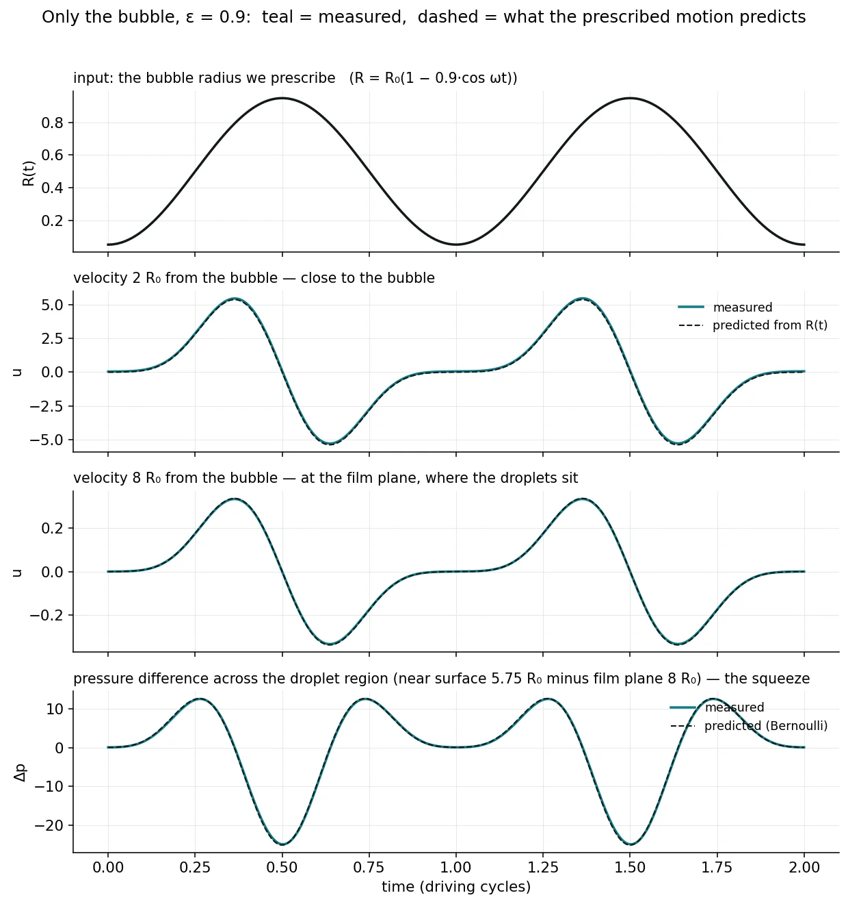
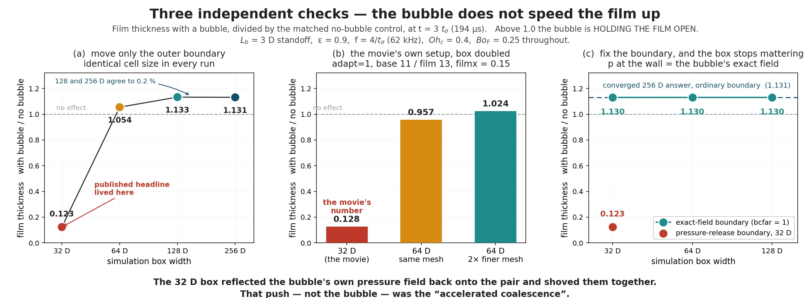

+++
title = 'Can a Pulsing Bubble Help Droplets Merge?'
date = 2026-09-11T11:00:00-04:00
draft = true
summary = "I tested whether a pulsing bubble helps water droplets in oil merge faster. It doesn't, and the result that said it did came from the edge of my simulation box."
tags = ['cfd', 'research']
+++

<!-- TODO: unpublished thesis work. Get your advisor's sign-off before publishing, especially on the withdrawn result. -->

Low-frequency ultrasound is used to break crude-oil emulsions, where water is suspended in oil as tiny droplets. One explanation for why it works: sound makes gas bubbles in the oil pulse, and a pulsing bubble next to two water droplets might help squeeze out the film of oil between them, so they merge sooner. I built a simulation to test that idea. The answer is no.

## The setup

- Two water droplets, 50 µm across, approach each other head-on in oil, with a pulsing bubble on the same axis. The simulation is axisymmetric (a 2D slice spun around that axis) and incompressible, written in [Basilisk](http://basilisk.fr/).
- Each droplet is tracked separately, so they can't merge in the code. "Merged" means the film between them has thinned below 1 µm. Real films rupture at 10 to 100 nm, finer than any grid I can afford, so the observable is when the film crosses 1 µm, and the check is that this time converges as the grid gets finer.
- The bubble is imposed, not simulated: a source of volume with a set radius over time. Outside an isolated pulsing sphere that's the exact solution, so it holds as long as the droplets stay a few bubble radii away.

## Gates before results

Nothing ran a real case until it reproduced a problem with a known exact answer:

- The pulsing source reproduces the exact flow around a pulsing sphere to within 1%.
- Two droplets on their own get the pressure jump across a curved surface and a droplet's natural wobble frequency right to within about 1–2%, never merge numerically, and their film converges as the grid is refined.
- With the bubble added, the effect scales with the square of the pulse amplitude, as theory says it should (measured exponent 2.06 ± 0.08, against 2).
- An upgraded bubble model failed one of its seven checks, so I dropped it rather than use it.

## The result that wasn't

In late July the simulations said the bubble made droplets merge 53% faster. I made a movie of it and shared it.

It was an artifact of the simulation box. The box was 32 droplet diameters wide, and its walls held the pressure at zero. Those walls reflected the bubble's own pressure field back onto the pair and pushed them together. Widen the box to 64, 128 or 256 diameters and the "speed-up" disappears (128 and 256 agree to 0.2%). Replace the walls with the bubble's exact far-field pressure and the box size stops mattering at all.

## What survived

With the box fixed, a bubble near the film *slows* drainage: by up to 28% when it sits 3.4 droplet diameters away, fading to nothing beyond about 8.

A back-of-the-envelope check then showed that the acoustic force in the frequency range industry actually uses is 10,000 to 100,000 times too weak to squeeze a pair together on the millisecond timescale these simulations cover. So the picture changed: sound gathers droplets and holds them together, the film drains on its own over tens of seconds, and the bottleneck is getting droplets to meet and stay together, not the film. That's the next thing to model, as population kinetics rather than more simulation.
