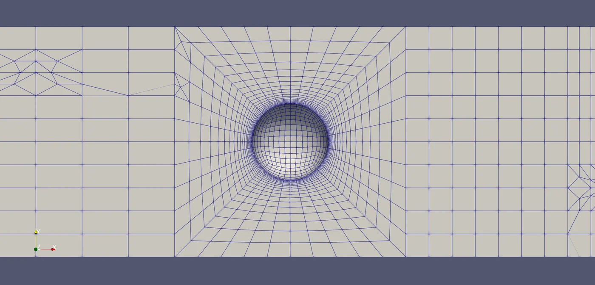
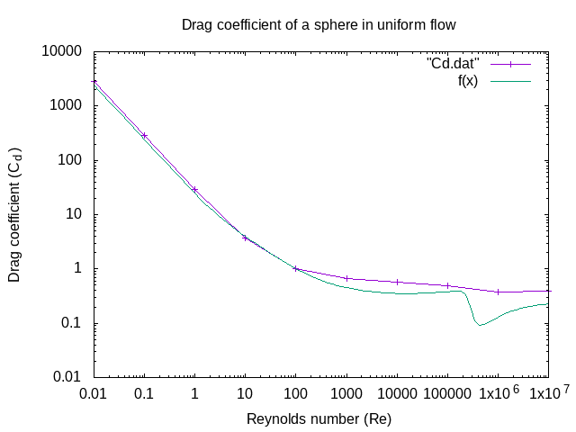

+++
title = 'dragOverSphere-PyFoam'
date = 2024-10-29T18:37:50-04:00
draft = false
summary = 'A 2021 OpenFOAM study of drag on a sphere across nine decades of Reynolds number, scripted with PyFoam, and the factor-of-two error in how its results were plotted.'
+++

I started this project in December 2021 to learn [PyFoam](https://pypi.org/project/PyFoam/), a Python library for scripting OpenFOAM: cloning cases, editing their settings files, and running the solvers. I wanted a problem with a well-known answer, and drag on a sphere is about as well-known as they come. Later, I presented this project to the Ansys Fluent testing team during my interview.

The code is on [GitHub](https://github.com/Davey-Gravy/dragOverSphere-PyFoam), and there's a [GitHub Pages deployment](https://davey-gravy.github.io/dragOverSphere-PyFoam/) of its README.

## The physics

Drag on a sphere is usually given as a drag coefficient, $C_d$: the drag force divided by the dynamic pressure and the sphere's frontal area. It depends almost entirely on the Reynolds number, $Re = UD/\nu$, which compares inertial to viscous forces using the flow speed, the sphere's diameter and the fluid's kinematic viscosity.

At very low Reynolds number, viscosity dominates and Stokes' law gives $C_d = 24/Re$. Through the middle of the range, $C_d$ levels off between about 0.4 and 0.5. Then, at a Reynolds number of a few hundred thousand, the boundary layer turns turbulent before it separates, the wake narrows, and $C_d$ falls sharply. That's the drag crisis.

For comparison I used Morrison's (2013) curve fit to experimental data, which covers the whole range.

## Setup

**Mesh.** I built the mesh in Blender with the SwiftBlock add-on, which writes an OpenFOAM `blockMeshDict`. The sphere is 2 m across. Six blocks wrap it, with the corners of an inner cube projected onto its surface so the cells follow the curve: 10 × 10 cells on each face, 600 on the sphere in total, growing outward over 20 layers to a 6 m cube. Two more blocks extend the domain 6 m upstream and 12 m downstream. That makes 14,000 cells in a 24 × 6 × 6 m box, with the sphere's center 4.5 diameters from the inlet, 7.5 from the outlet, and 1.5 from each side wall.

**Solver.** `simpleFoam`, OpenFOAM's steady-state incompressible solver, with no turbulence model. The boundary conditions and numerical settings were adapted from OpenFOAM's `motorBike` tutorial, which is set up like a wind tunnel: a fixed 1 m/s inflow, fixed pressure at the outlet, a no-slip sphere, and side walls held at the free-stream velocity, which keeps them from growing boundary layers of their own. Each case ran 500 iterations, with a `forceCoeffs` function object recording $C_d$ along the way.

**The sweep.** The flow speed and sphere size stay fixed and the viscosity changes instead: ten values from 100 down to 10⁻⁷ m²/s, one decade apart. A 37-line PyFoam script clones a template case for each viscosity, writes the new value into `transportProperties`, runs `blockMesh`, splits the case into six parallel pieces, and runs the solver. A shell script pulls the final $C_d$ out of each case, and gnuplot plots them against the correlation.

## What it showed

As plotted, the simulation tracks the correlation at low Reynolds number: about 20% high up to $Re = 1$, and within 7% at 10 and 100. From 1,000 to 10,000 it runs 40 to 50% high, and it shows no drag crisis at all.

The missing drag crisis is expected. It comes from the boundary layer turning turbulent, which a laminar model can't do. A steady solver is also out of its depth above a Reynolds number of a few hundred, where a real sphere's wake starts shedding vortices, and the scripts take $C_d$ from the last iteration without checking that it had settled.

## The factor of two

The low-Reynolds-number agreement doesn't survive a closer look. The script sets $Re = 1/\nu$. With a 1 m/s inflow, that's the Reynolds number based on the sphere's *radius*, 1 m. The correlation, like nearly every sphere-drag reference, uses the diameter, so every simulated point is plotted at half its actual Reynolds number.

In the Stokes range, where $C_d$ is inversely proportional to $Re$, that shifts the comparison by a factor of two. Read at the right Reynolds number, the simulated drag there is a bit more than double the correlation, not 20% high. The drag coefficients themselves were normalized correctly: the reference area is 3.14 m², the frontal area of a sphere with a 1 m radius.

I haven't rerun it to find out where the extra drag comes from. The first suspect is the box. The side walls are only 1.5 diameters from the sphere's center, and in slow viscous flow the disturbance a sphere makes fades only as the inverse of distance, so walls that close add drag.

## What's missing

- A mesh convergence study. It's still on the README's to-do list.
- A check that the domain is large enough not to change the answer.
- A check that each run had converged before its $C_d$ was recorded.
- The Reynolds number fix in the scripts. The README and its GitHub Pages deployment still show the original comparison.
