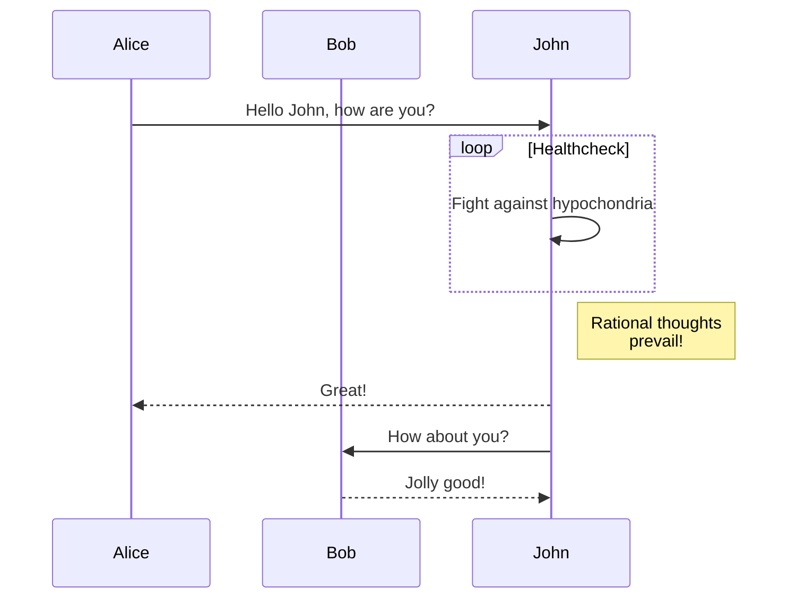

+++
title = '2024 07 05'
date = 2024-07-05T13:38:51-04:00
draft = true
+++

This update is being used to test a video shortcode:



Thanks to [this link](https://roneo.org/en/hugo-create-a-shortcode-for-local-videos/)

<!--more-->

I am also testing Mermaid.js diagrams:



Also inline syntax highlighting?

```python
def add (x1, x2):
    return x1 + x2
```